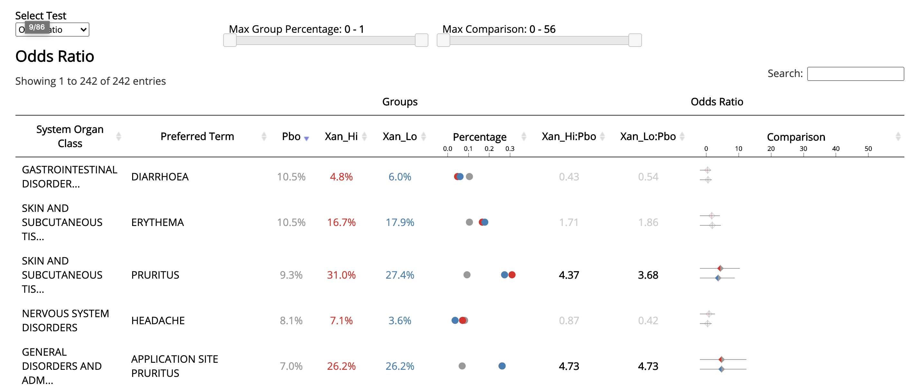

# Forest Plot

This repo contains a JavaScript library that allows users to dynamically explorer adverse event results data in real time. A typical forest plot can be found [here](https://jwildfire.github.io/forest-plot/test-page/) - it looks like this: 



# Data Specifications 

The chart is created using a analysis results data (as opposed to raw adverse even data). The data set should have one record per test type (e.g. odds ratio) per class of adverse event (e.g. system organ class/preferred term). The following columns are required (chart mapping variable names are in parenthesis).

| Column                              | Setting          | Default  | Description                                          |
|-------------------------------------|------------------|----------|------------------------------------------------------|
| High Level Classification           | high_level_col   | AEBODSYS | High Level Adverse Event Class                       |
| Low Level Classification            | low_level_col    | AEDECOD  | Low Level Adverse Event Class                        |
| Group 1                             | group1_col       | Group1   | Name of first group in comparison (e.g. "Treatmemt") |
| Group 2                             | group2_col       | Group2   | Name of second group in comparison (e.g. "Placebo")  |
| Group 1 Numerator                   | numerator1_col   | n1       | Number of cases (numerator) for group 1              |
| Group 2 Numerator                   | numerator2_col   | n2       | Number of cases (numerator) for group 2              |
| Group 1 Denominator                 | denominator1_col | N1       | Number of participants (denominator) for group 1     |
| Group 2 Denominator                 | denominator2_col | N2       | Number of participants (denominator) for group 2     |
| Test Type                           | test_col         | Test     | Type of test (e.g. "Odds Ratio")                     |
| Test Result                         | result_col       | Res      | Result of Test                                       |
| Test Result - Upper Limit of Normal | result_upper_col | CI_Upper | Upper Limit of Normal for Test Result                |
| Test Result - Lower Limit of Normal | result_lower_col | CI_Lower | Lower Limit of Normal for Test Result                |
| Test Result - p-value               | p_col            | Pvalue   | P value for Test Result                              |

A sample data set using the default column mappings described is used to generate the example above and can be found [here](https://github.com/jwildfire/forest-plot/blob/master/test-page/forest_plot_test_data.csv).

# Technical Specification 

To generate a forest plot, simply load the data set, provide a configuration object with mappings, and initialize the chart using the `forestPlot()` function, like so:

```
d3.csv('forest_plot_test_data.csv', function (data) {
    let settings = {
        high_level_col:"AEBODSYS",
        low_level_col:"AEDECOD",
        group1_col:"Group1",
        group2_col:"Group2",
        numerator1_col: "n1",
        numerator2_col:"n2",
        denominator1_col:"N1",
        denominator2_col:"N2",
        test_col: "Test",
        result_col:"Res",
        result_upper_col:"CI_Upper",
        result_lower_col:"CI_Lower",
        p_col:"Pvalue"
    }
    forestPlot(data, "#container", settings)
});
```

See [here](https://github.com/jwildfire/forest-plot/blob/master/test-page/index.html) for the full code used to generate our example graphic. 